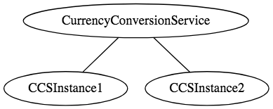
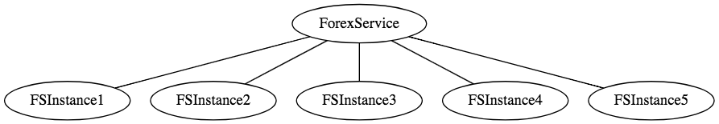
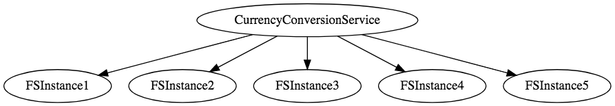

# Spring Boot的微服务 part1 入门

在本系列的第一部分中，我们将了解微服务的概念，并了解如何使用Spring Boot和Spring Cloud创建微服务。

本指南将帮助您了解微服务和微服务架构的基础知识。我们还将开始研究使用Spring Boot的微服务的基本实现。

我们将创建一些微服务，并让他们使用Eureka命名服务器和功能区相互通信，以实现客户端负载平衡。

在本系列的第1部分中，我们将介绍微服务的概念，并了解如何使用Spring Boot和Spring Cloud创建出色的微服务。

## 你会学到什么

- 什么是monolith
- 什么是microservice
- 微服务面临的挑战是什么？
- Spring Boot和Spring Cloud如何使开发微服务变得容易？
- 如何使用Ribbon实现客户端负载平衡。
- 如何实现命名服务器（Eureka命名服务器）。
- 如何将微服务与命名服务器和功能区连接。

## 资源概述

在本指南中，我们将使用正确的URI和HTTP方法创建一个公开三种服务的学生资源：

- 查询所有学生 - @GetMapping("/students")
- 获取学生的详细信息 - @GetMapping("/students/{id}")
- 删除学生 - @DeleteMapping("/students/{id}")
- 创建一个新学生 - @PostMapping("/students")
- 更新学生详细信息 - @PutMapping("/students/{id}")

## 微服务概述

在本系列文章中，我们将创建两个微服务：

- 外汇服务 - 缩写为FS
- 货币兑换服务 - 缩写为CCS

如果你感到有点疑惑，不要担心。在我们逐步创建微服务之前给出一个大图。

### 外汇服务

外汇服务（FS）是服务提供商。它提供各种货币的货币兑换价值。我们假设它与Forex Exchange交易并提供货币之间的当前转换价值。

示例请求和响应如下所示：

> GET to http://localhost:8000/currency-exchange/from/EUR/to/INR

以上请求是EUR兑换INR的货币兑换值。在响应中，conversionMultiple是75.稍后我们将讨论响应中的端口。

### 货币兑换服务

货币兑换服务（CCS）可以将一桶货币转换为另一种货币。它使用外汇服务获取当前货币兑换值。CCS是服务消费者。

示例请求和响应如下所示：

> GET to http://localhost:8100/currency-converter/from/EUR/to/INR/quantity/10000

```json
{
  id: 10002,
  from: "EUR",
  to: "INR",
  conversionMultiple: 75,
  port: 8000,
}
```

下图显示了CCS和FS之间的通信。


### Eureka命名服务器和功能区

根据负载，我们可以运行货币转换服务和外汇服务的多个实例。




每项服务的实例数可能会随时间而变化。下图显示了一个特定的实例，其中有五个外汇服务实例。



在上述情况下需要发生的是负载应该在这五个实例之间均匀分布。



## 什么是monolith应用？

你曾经参与过一个项目吗？

- 每隔几个月发布一次（投入生产）？
- 哪个具有广泛的特性和功能？
- 哪个团队有超过50人参与其中？
- 哪里调试问题是一个很大的挑战？
- 何时引入新技术和新工艺？几乎是不可能的？

这些是整体应用的典型特征。Monolith应用程序通常很庞大 - 超过100,000行代码。在某些情况下甚至超过百万行代码。巨石的特点是

- 应用程序大小
- 版本更新时间长
- 大团队

典型问题包括

- 可扩展性挑战
- 新技术的采用
- 新流程 - 敏捷？
- 难以执行自动化测试
- 难以适应现代发展实践
- 适应设备崩溃

## 什么是微服务？

微服务架构随着单片架构的发展，成为可扩展性和创新挑战的解决方案。

微服务的许多定义：

>Small autonomous services that work together. - Sam Newman

> Developing a single application as a suite of small services each running in its own process and communicating with lightweight mechanisms, often an HTTP resource API. These services are built around business capabilities and independently deployable by fully automated deployment machinery. There is a bare minimum of centralized management of these services, which may be written in different programming languages and use different data storage technologies. - James Lewis and Martin Fowler

虽然微服务没有单一的可接受定义，但对我来说，有一些重要特征：

- REST - 围绕RESTful资源构建。通信可以是HTTP或基于事件的。
- 小井选择可部署单位 - 有界上下文
- 启用云 - 动态扩展
